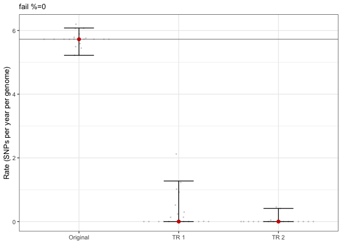
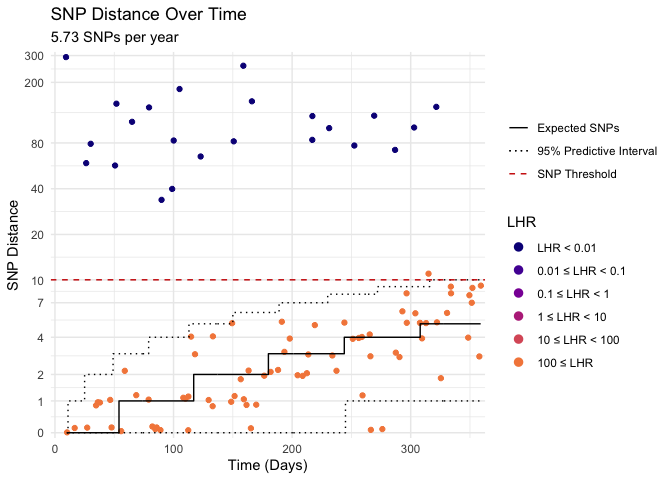

<!-- README.md is generated from README.Rmd. Please edit that file -->

# MxSure

<!-- badges: start -->

<!-- badges: end -->

This package implements a mixture distribution approach to estimating
substitution rates and SNP thresholds from pairwise SNP comparison data,
in a longitudinal/within-host or transmission setting. It also provides
some plotting and simulation functions.

## Installation

You can install the development version of mxsure from
[GitHub](https://github.com/) with:

``` r
install.packages("remotes")
remotes::install_github("ZunairKhm/mxsure")
```

## Basic Operation

MxSure in an R package designed to estimate substitution rates and infer
SNP thresholds from longitudinally collected pairwise SNP comparison
data. This data is likely to contain a mixture of related pairs (from
longitudinal samples of the same microbe showing evolution over time)
and unrelated pairs (co-captured samples from the same strain/species).

To demonstrate its use we can first simulate some example data using the
`simulate_mixsnp_data()` command. Here we simulate 100 data points (each
representing a pairwise SNP comparison between two sequences) with a
true substitution rate of 5 SNPs/year with each data point having an 80%
chance to be a related data point. By default sampling time differences
for each of these data points are between 0 and 1 year.

``` r
library(mxsure)
set.seed(123)
mixed_data <- simulate_mixsnp_data(lambda=5, k=0.8, n=100)
head(mixed_data, 5)
#> # A tibble: 5 × 3
#>   snp_dist time_dist relation 
#>      <dbl>     <dbl> <chr>    
#> 1      181     105.  Unrelated
#> 2        0      16.6 Related  
#> 3        8     349.  Related  
#> 4       34      89.9 Unrelated
#> 5        3     234.  Related
```

MxSure’s methodology is to fit a mixture distribution, which describes
the related and unrelated SNP distances in separate models, to this
dataset. However, to do this we need to fit the unrelated SNP distance
model (a right truncated negative binomial distribution) on another
dataset of pairwise SNP comparisons that has no related pairs. This
could be comparisons between different individuals and ideally
individuals that are geographically separated to exclude transmission
events. Here we again simulate the data using the same true substitution
rate but with related proportion, k, set to 0.

``` r
distant_data <- simulate_mixsnp_data(lambda=5, k=0, n=1000)
head(distant_data, 5)
#> # A tibble: 5 × 3
#>   snp_dist time_dist relation 
#>      <dbl>     <dbl> <chr>    
#> 1       36      5.90 Unrelated
#> 2       96    239.   Unrelated
#> 3      129    331.   Unrelated
#> 4      163    151.   Unrelated
#> 5      137    103.   Unrelated
```

We can then use `mxsure_estimate()` to estimate the substitution rate,
estimate the related proportion, and infer a SNP threshold.

``` r
result <- mxsure_estimate(
  mixed_snp_dist = mixed_data$snp_dist,
  unrelated_snp_dist = distant_data$snp_dist,
  mixed_time_dist = mixed_data$time_dist
)
result
#> # A tibble: 1 × 8
#>   snp_threshold lambda     k intercept estimated_fp lambda_units   nb_size nb_mu
#>           <dbl>  <dbl> <dbl>     <dbl>        <dbl> <chr>            <dbl> <dbl>
#> 1            10   5.73 0.770    -0.146        0.002 SNPs per year…    4.07  125.
```

Here lambda is the estimated substitution rate and k is the estimated
related proportion. Intercept is a time independent parameter that
describes the expected SNPs at time 0, which can be used to model
sequencing error. Estimated fp displayed the proportion of the distant
dataset that has a SNP distance below the inferred SNP threshold.
nb_size and nb_mu are the parameters of the unrelated SNP distance
model.

As in this example, if sites considered are not supplied for each
comparison in the mixed dataset the estimated rate will have units
SNPs/year/genome. We can display what this by simulating some amount of
sites.

``` r
mixed_data_sites <- mixed_data
mixed_data_sites$sites <- runif(100, 0.5e6, 1.5e6)

result_sites <- mxsure_estimate(
  mixed_snp_dist = mixed_data_sites$snp_dist,
  unrelated_snp_dist = distant_data$snp_dist,
  mixed_time_dist = mixed_data_sites$time_dist,
  mixed_sites = mixed_data_sites$sites
)
result_sites
#> # A tibble: 1 × 12
#>   snp_threshold     lambda     k intercept estimated_fp lambda_units convergence
#>           <dbl>      <dbl> <dbl>     <dbl>        <dbl> <chr>              <int>
#> 1            10 0.00000565 0.770   -0.0324        0.002 SNPs per ye…           0
#> # ℹ 5 more variables: message <chr>, iterations <int>, nb_size <dbl>,
#> #   nb_mu <dbl>, lambda_per_genome <dbl>
```

## Youden and Threshold Range

For threshold assessment it may be useful to compare the MxSure
threshold with what would be inferred from the Youden method.

``` r
result <- mxsure_estimate(
  mixed_snp_dist = mixed_data$snp_dist,
  unrelated_snp_dist = distant_data$snp_dist,
  mixed_time_dist = mixed_data$time_dist,
  youden = TRUE
)
result$youden
#> # A tibble: 1 × 3
#>   youden_snp_threshold     J youden_estimated_fp
#>                  <dbl> <dbl>               <dbl>
#> 1                   11 0.768               0.002
```

It may also be useful to examine how a different threshold time affects
the MxSure threshold.

``` r
result <- mxsure_estimate(
  mixed_snp_dist = mixed_data$snp_dist,
  unrelated_snp_dist = distant_data$snp_dist,
  mixed_time_dist = mixed_data$time_dist,
  threshold_range = TRUE
)
result$threshold_range
#>    years threshold estimated_fp prop_pos
#> 1    0.5         6        0.000     0.69
#> 2    1.0        10        0.002     0.76
#> 3    1.5        13        0.002     0.77
#> 4    2.0        17        0.003     0.77
#> 5    2.5        21        0.010     0.77
#> 6    3.0        24        0.013     0.77
#> 7    3.5        27        0.019     0.77
#> 8    4.0        31        0.026     0.77
#> 9    4.5        34        0.036     0.78
#> 10   5.0        38        0.047     0.78
#> 11   5.5        41        0.058     0.79
#> 12   6.0        44        0.066     0.79
#> 13   6.5        47        0.077     0.79
#> 14   7.0        51        0.091     0.79
#> 15   7.5        54        0.103     0.79
#> 16   8.0        57        0.121     0.80
#> 17   8.5        60        0.139     0.81
#> 18   9.0        63        0.159     0.81
#> 19   9.5        67        0.181     0.82
#> 20  10.0        70        0.200     0.82
```

## Confidence Intervals

Confidence intervals for substitution rate estimation are produced via
bootstrapping. This can be computed faster with multi-threading using
the future package. 20 bootstraps is very likely too few, you would
likely need at least 200 but ideally 500 or 1000.

``` r
future::plan("future::multisession", workers=2)
ci <- mxsure_ci( mixed_snp_dist = mixed_data$snp_dist,
  unrelated_snp_dist = distant_data$snp_dist,
  mixed_time_dist = mixed_data$time_dist,
  bootstraps=20
  )
future::plan("future::sequential")
ci$confidence_intervals
#> # A tibble: 2 × 5
#>   snp_threshold lambda     k intercept estimated_fp
#>           <dbl>  <dbl> <dbl>     <dbl>        <dbl>
#> 1             9   5.22 0.754    -0.161       0     
#> 2            10   6.08 0.823    -0.130       0.0041
```

## Time Randomisation Test

This is a test that validates there is temporal signal in the underlying
data. It achieves this by randomly permuting the time column in the
mixed dataset and produces estimates and 95% CIs on this time randomised
dataset. This is repeated on multiple time randomisation datasets, 10 is
recommended, and if more than 5% of these bootstrap samples are above or
equal to the original estimate this test is failed. Estimates should not
be considered to be valid if this test fails. The output of this
function is a graph showing this result and an outcome table.

``` r
future::plan("future::multisession", workers=2)
timerand <- mxsure_timerandtest( mixed_snp_dist = mixed_data$snp_dist,
  unrelated_snp_dist = distant_data$snp_dist,
  mixed_time_dist = mixed_data$time_dist,
  bootstraps=20,
  permutations=2,
  original_result = result$results,
  ci_data = ci
  )
#> [1] "Processing Permutation: 1"
#> [1] "Processing Permutation: 2"
future::plan("future::sequential")
timerand$plot
```



``` r
timerand$outcome
#> # A tibble: 1 × 8
#>   n_permutations any_overlapping_est n_overlapping_est perc_overlapping_est
#>            <dbl> <lgl>                           <int>                <dbl>
#> 1              2 FALSE                               0                    0
#> # ℹ 4 more variables: any_overlapping_lowci <lgl>, n_overlapping_lowci <int>,
#> #   perc_overlapping_lowci <dbl>, failure_perc <dbl>
```

## Likelihood ratios, and SNP over Time plot

For each data point in the mixed dataset, after fitting, we can assess
the likelihood that any is related or unrelated. This is achieved using
the `mxsure_likelihood()` function which reports likelihoods, log
likelihoods, and likelihood ratios.

``` r
likelihoods <- mxsure_likelihood(mixed_snp_dist = mixed_data$snp_dist,
  unrelated_snp_dist = distant_data$snp_dist,
  mixed_time_dist = mixed_data$time_dist)
head(likelihoods, 5)
#> # A tibble: 5 × 9
#>   snp_dist time_dist sites rel_loglh unrel_loglh  logLHR    rel_lh    unrel_lh
#>      <dbl>     <dbl> <dbl>     <dbl>       <dbl>   <dbl>     <dbl>       <dbl>
#> 1      181     105.      1  -692.          -5.76 -686.   4.80e-301 0.00315    
#> 2        0      16.6     1    -0.115      -14.1    13.9  8.92e-  1 0.000000788
#> 3        8     349.      1    -2.55        -9.12    6.58 7.83e-  2 0.000109   
#> 4       34      89.9     1   -81.9         -6.02  -75.9  2.67e- 36 0.00242    
#> 5        3     234.      1    -1.54       -11.1     9.57 2.15e-  1 0.0000149  
#> # ℹ 1 more variable: LHR <dbl>
```

Based on these likelihoods we can plot the original data with SNP
distance versus time distance for each comparisons, using the
`snp_over_time()` function. We colour the points as their likelihoods.
We can also plot the predictive intervals and inferred SNP threshold.
`snp_over_time()` calls `mxsure_likelihood()` under the hood.

``` r
snp_over_time(mixed_snp_dist = mixed_data$snp_dist,
  unrelated_snp_dist = distant_data$snp_dist,
  mixed_time_dist = mixed_data$time_dist
  )
#> Warning: Removed 9 rows containing missing values or values outside the scale range
#> (`geom_step()`).
#> Removed 9 rows containing missing values or values outside the scale range
#> (`geom_step()`).
#> Removed 9 rows containing missing values or values outside the scale range
#> (`geom_step()`).
```


